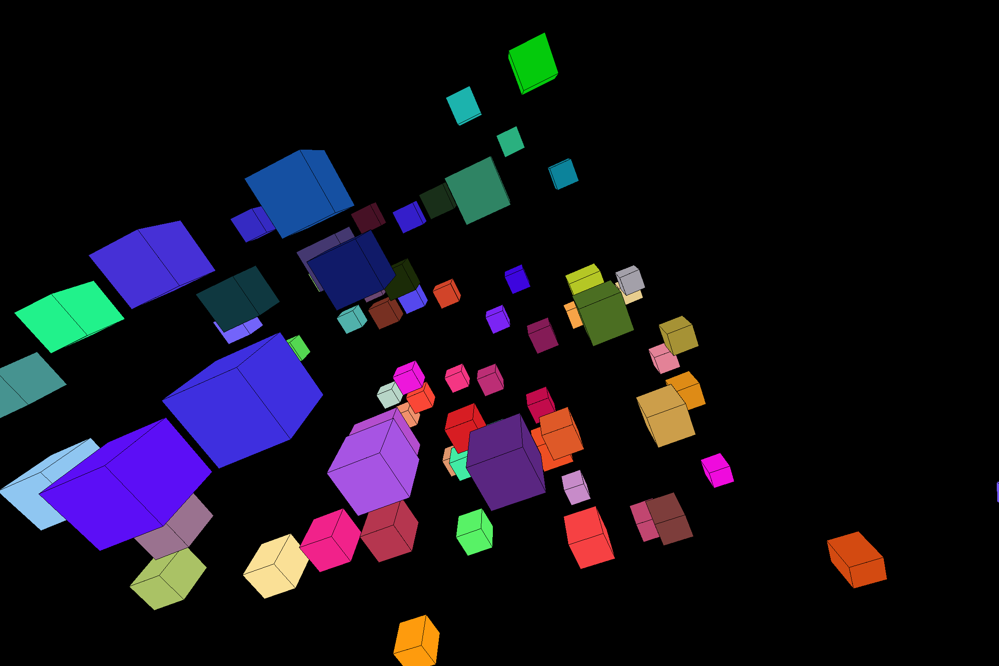

# 3DX

This is the 3D engine production project.

## 移動

+ `W` : 前進
+ `S` : 後進
+ `D` : 右へ移動
+ `A` : 左へ移動
+ `Space` : 上へ移動 **(正の方向にy軸移動)**
+ `Shift` : 下へ移動 **(負の方向にy軸移動)**

## 視点

視点はマウスで動かせます。
また、マウススクロールでズームが可能です

+ `X` : 視点リセット
+ `O` : ポリゴンのアウトラインのON/OFF
+ `Enter` : 詳細メニューの表示/非表示

## ブロック

+ `BackSpace` : カーソル上にあるブロックを削除できます
+ `Delete` : 存在するブロックを全て削除します。
+ `R` : ランダムにブロックを生成します。
+ `Tab` : 地面の隆起が変化します。

+ `右クリック` : カーソル上のポリゴンを非表示にします。
+ `左クリック` : カーソル上のポリゴンを表示します。

## システム

+ `Escape` : システムが終了します。
+ `P` : スクリーンショットを撮影します

# 技術関連

[3次元を２次元に投射する方法](docs/MATH/Vector.md)

